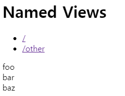

# Vue-router

새로고침을 하지 않은채 화면을 변경하게 하는  
SPA(Single Page Application) 과 같은 효과를 낼 수 있다.
[링크](https://router.vuejs.org/kr/guide/#javascript)

vue cli 의 예제는 아래와 같다.

```js
// ./router/index.js
import Vue from 'vue'

// vue-router 가져오기
import Router from 'vue-router'

// 외부에서 컴포넌트 가져오기
import HomePage from '@/components/Home'
import BodyCheckPage from '@/components/NaviItems/BodyCheckPage'
import LoginPage from '@/components/NaviItems/LoginPage'


Vue.use(Router)

export default new Router({
  routes: [
    {
      path: '/',
      name: 'Home',
      component: HomePage
    },
    {
      path: '/body-check', /
      name: 'BodyCheckPage',
      props: true,
      component: BodyCheckPage
    },
    {
      path: '/login-page',
      name: 'LoginPage',
      component: LoginPage
    },
  ]
})
```

```js
// ./main.js
import Vue from 'vue'
import App from './App'
import router from './router'

/* eslint-disable no-new */
new Vue({
  el: '#app',
  router,
  components: { App },
  template: '<App/>'
})
```

```html
<!-- ./App.vue -->
<template>
  <div id="app">
    <div id="screen" >
      <!-- 이 부분만 화면이 바뀌게 됨 -->
      <router-view/>
    </div>
  </div>
</template>
```

\<router-link>는 현재 라우트와 일치할 때 자동으로 .router-link-active 클래스가 추가된다.

<br/>

## 동적 라우트 매칭

주어진 패턴을 가진 라우트를 동일한 컴포넌트에 매핑할 수 있다.  
vue-router는 라우트 매칭 엔진으로 [path-to-regexp](https://github.com/pillarjs/path-to-regexp/tree/v1.7.0) 를 사용한다. [예제](https://github.com/vuejs/vue-router/blob/dev/examples/route-matching/app.js)

심볼| 설명| $route.params
:--:|:--|:--:|
:string| 해당 string이 필요| /user/:username  
:string?| 해당 string 있어도 없어도 됨| /user/:username?
:string(정규식)| 정규식에 해당하는 것 매칭| /params-with-regex/:id(\\d+)
\*| 모든 것과 매칭| /asterisk/*
(component/)?| 괄호를 씌워 ?를 사용하면 <br/>해당 path 있어도 없어도 됨 | '/optional-group/(foo/)?bar

### 매칭 우선순위

동일한 URL이 여러 라우트와 일치하는 경우에는 경로가 더 먼저 정의 될수록 우선 순위가 높다.

<br/>

## 중첩 라우트

- 라우터로 화면 이동시 Nested(중첩된) 라우트를 이용하여 여러개의 컴포넌트를 동시에 렌더링 할 수 있다.
- '/' 로 시작하는 중첩 된 라우트는 루트 경로로 취급


```html
const User = {
  template: `
    <div class="user">
      <h2>User {{ $route.params.id }}</h2>
      <router-view></router-view>
    </div>
  `
}
```

```js
const router = new VueRouter({
  routes: [
    { path: '/user/:id', component: User,
      children: [
        // /user/:id 와 일치할 때, 루트 경로
        {
          path: '', component: UserHome
        },
        {
          // /user/:id/profile 과 일치 할 때
          // UserProfile 컴포넌트는 User의 <router-view> 내에 렌더링 된다.
          path: 'profile',
          component: UserProfile
        },
        {
          // /user/:id/posts 과 일치 할 때
          // UserPosts가 User의 <router-view> 내에 렌더링 된다.
          path: 'posts',
          component: UserPosts
        }
      ]
    }
  ]
})
```

<br/>

## 이름을 가지는 뷰

경로가 아닌 이름(라우터 별칭 아님 이는 [여기](./뷰-라우터_중급.md)를 참조)으로 컴포넌트를 사용할 수도 있다.

```html
<router-view class="view one"></router-view>
<router-view class="view two" name="a"></router-view>
<router-view class="view three" name="b"></router-view>
```

```js
const Foo = { template: '<div>foo</div>' }
const Bar = { template: '<div>bar</div>' }
const Baz = { template: '<div>baz</div>' }

const router = new VueRouter({
  routes: [
    {
      // 경로가 '/' 인 경우 Foo, Bar, Baz 순으로 등장함
      path: '/',
      components: {
        default: Foo,
        a: Bar,   // a
        b: Baz
      }
    }
  ]
})
```

- 결과  
<kbd>
  
</kbd>

<br/>

## 프로그래밍 방식 네비게이션

history 조작을 통해 사용자 기록(history, 웹 페이지 이동한 기록)을 앞뒤로 탐색할 수 있다.

### router.push()

구분| 설명| 예
:--:|--|:--:
선언적 방식| html 파일에서 사용 | \<router-link :to="컴포넌트" />
프로그래밍 방식| js 파일에서 사용 | this.$router.push( {path: '뒤에 붙여지는 경로'} )

```js
// 리터럴 string
router.push('home')

// object
router.push({ path: 'home' })

// 이름을 가지는 라우트
router.push({ name: 'user', params: { userId: 123 }})

// 쿼리와 함께 사용, 결과는 /register?plan=private
router.push({ path: 'register', query: { plan: 'private' }})
```

```html
<router-link :to="...">
```

### router.go(n)

- 히스토리 스텍에서 n만큼 이동한다.

```js
// 앞으로 페이지 이동
router.go(1)

// 뒤로 페이지 이동
router.go(-1)

// 지정한 만큼의 기록이 없으면 자동으로 실패
router.go(-100)
```

### router.replace(location)

- router.push()와 같은 역활 수행하나 새로운 URL을 히스토리 스택에 추가하지 않음 즉, 현재 URL을 대체함

```js
// 히스토리 스텍에 추가하지 않고 새로운 url로 대체
router.replace(...)
```

```html
<!-- 클릭하면 router.replace(...) 호출하는 것과 같다. -->
<route-link :to="..." replace>
```
